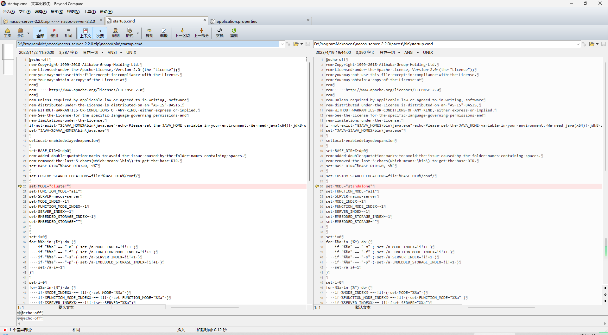
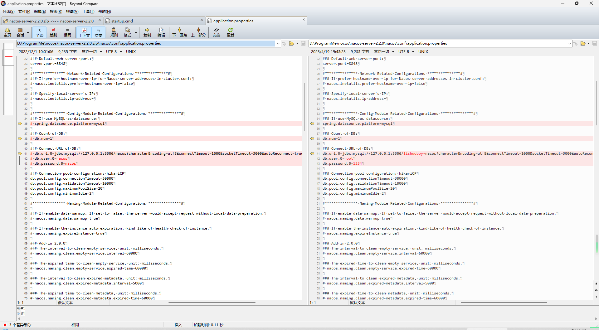

- [nacos-官网](https://nacos.io/zh-cn/index.html)
- [nacos-github下载地址](https://github.com/alibaba/nacos/tags)

# 1.单机模式启动

- 默认为`cluster`模式，改为`standalone`模式

1. 命令行

```shell
startup.cmd -m standalone
```

2. 改默认配置
   

```shell
startup.cmd
```

# 2.修改为使用mysql数据【非必需】

- 默认使用嵌入式`derby`数据

1. 修改配置
   

2. 创建数据库执行sql脚本


